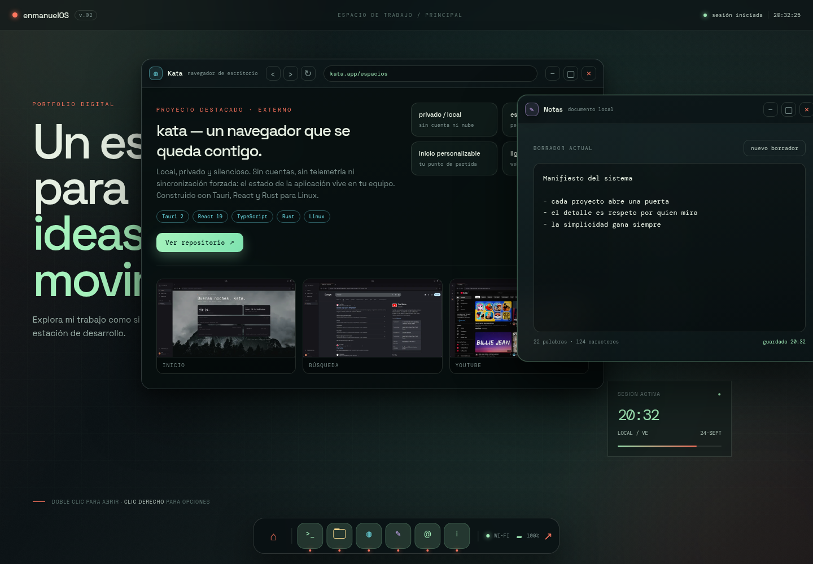
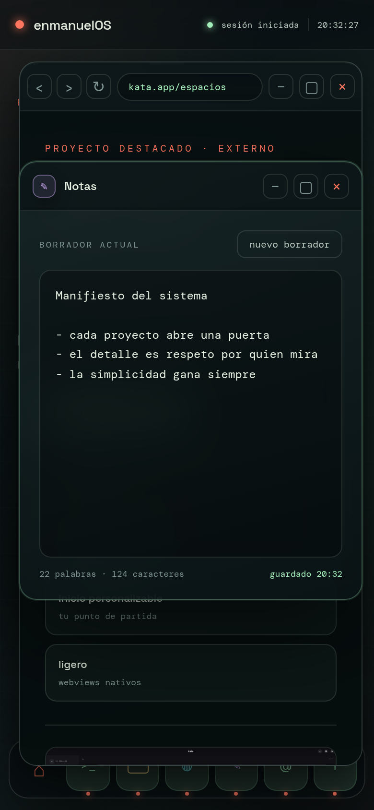

# Desktop — enmanuelOS

Un portfolio presentado como una **experiencia de escritorio** real: un sistema operativo simulado con arranque, gestor de ventanas, dock con magnificación, terminal interactiva y seis aplicaciones.

En lugar de una landing page, el visitante **enciende enmanuelOS** y explora el trabajo como si estuviera frente a la estación de desarrollo de su autor.

## Descripción

Desktop no es solo una página: es un entorno. Un overlay de arranque da paso a un escritorio con iconos arrastrables, ventanas de cristal que se minimizan al dock, un menú contextual, fondos de pantalla intercambiables y persistencia local de todo el estado (posiciones, fondo, notas).

Dentro del sistema se presenta **kata** — un navegador de escritorio construido por el mismo autor con Tauri — como proyecto destacado externo, con sus capturas reales y enlace al repositorio.

## Aplicaciones del escritorio

| App | Qué hace |
| --- | --- |
| **Proyectos** | Directorio con los proyectos del portfolio (Mercium, Sysdash, Vellum y Kata) |
| **Terminal** | Consola interactiva con `help`, `neofetch`, `open`, `wallpaper`, historial con ↑/↓ y autocompletado con Tab |
| **Kata** | Showcase del navegador de escritorio: capturas reales, stack (Tauri 2, React 19, TypeScript, Rust) y enlace a `github.com/enmanuel400/Kata` |
| **Contactos** | GitHub, LinkedIn, Gmail y WhatsApp |
| **Notas** | Editor con autoguardado, contador de palabras/caracteres y estado de guardado |
| **Acerca de** | Info del sistema estilo `neofetch` (uptime, resolución) + pitch personal |

## Funcionalidades principales

- **Arranque del sistema**: overlay con logo, líneas de boot animadas y barra de progreso (se puede saltar con clic).
- **Gestor de ventanas**: abrir, minimizar (con animación al dock), maximizar/restaurar, cerrar y arrastrar; foco por z-index y título destacado.
- **Dock como taskbar**: clic enfoca/minimiza/restaura, indicadores de app activa y **magnificación al hover**.
- **Escritorio interactivo**: doble clic abre (un toque en táctil), clic selecciona, iconos **arrastrables** con posición persistida.
- **Menú contextual** (clic derecho): abrir apps, cambiar fondo, restaurar escritorio y cerrar ventanas.
- **Tres fondos de pantalla** (Noche, Bosque, Amanecer) con persistencia, desde el menú o `wallpaper <1|2|3>` en la terminal.
- **Terminal ampliada**: `help`, `about`, `proyectos`, `contactos`, `kata`, `notas`, `acerca`, `open <app>`, `wallpaper`, `neofetch`, `echo`, `whoami`, `ls`, `date`, `uptime`, `clear`; historial con ↑/↓ y autocompletado con Tab.
- **Cita de kata**: ventana propia con capturas reales del navegador y enlace al repositorio.
- **Persistencia local**: nota, fondo de pantalla, posición de iconos y de ventanas sobreviven a la recarga (localStorage).
- **Responsive**: en móvil los iconos se abren con un toque, el dock se compacta y las ventanas se adaptan.

## Atajos de teclado

| Atajo | Acción |
| --- | --- |
| `Ctrl + T` | Abrir Terminal |
| `Ctrl + K` | Abrir Kata |
| `Ctrl + N` | Abrir Notas |
| `Enter` | Abrir la app seleccionada |
| `Esc` | Cerrar todas las ventanas |
| ↑ / ↓ en la terminal | Historial de comandos |
| `Tab` en la terminal | Autocompletar comando |

## Cita del proyecto kata

**kata** es un navegador de escritorio local, privado y silencioso para Linux, construido con Tauri 2, React 19, TypeScript y Rust. Sin cuentas, sin telemetría ni sincronización forzada: el estado vive en el equipo del usuario. Su espacio de trabajo y página de inicio son personalizables.

- Repositorio: [github.com/enmanuel400/Kata](https://github.com/enmanuel400/Kata)
- Capturas propias integradas en la ventana Kata de este escritorio (`assets/kata-*.webp`)

## Vista previa

## Demo en vivo

https://portfolio-desktop-enmanuel.netlify.app

## Cómo ejecutarlo

Abre `index.html` en el navegador. No requiere build ni dependencias: HTML, CSS y JavaScript puros.

## Stack

- HTML5
- CSS3 (fondos, cristal/blur, animaciones, responsive)
- JavaScript (ventanas, arrastre, terminal, persistencia en localStorage)
- Google Fonts: Space Grotesk + DM Mono

## Estructura

- `index.html` — estructura del sistema (boot, escritorio, dock, 6 ventanas, menú contextual)
- `style.css` — identidad visual enmanuelOS (3 fondos, ventanas de cristal, dock)
- `app.js` — lógica del escritorio (gestor de ventanas, terminal, notas, persistencia)
- `assets/` — capturas webp del proyecto kata para la ventana del navegador

## Resumen

Desktop transforma el portfolio en una experiencia memorable: un sistema que se enciende, se explora y se queda — con ventanas que se minimizan, una terminal que responde, notas que se guardan solas y un navegador propio entre los proyectos.