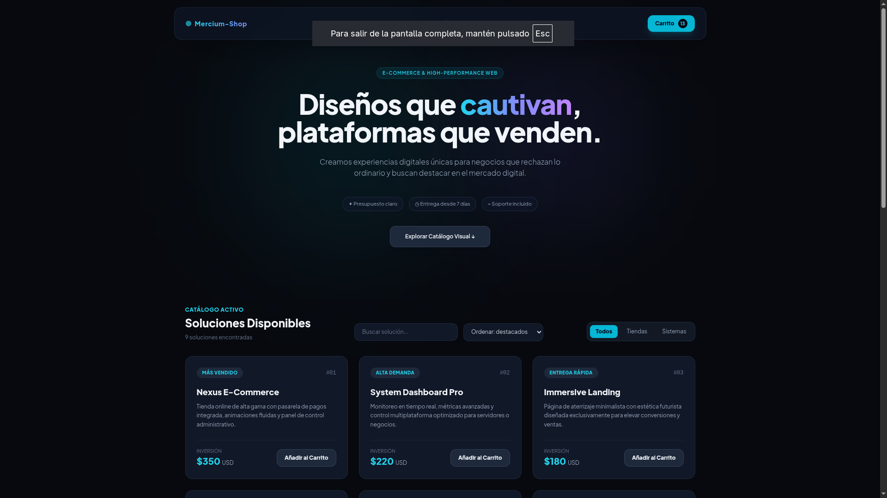
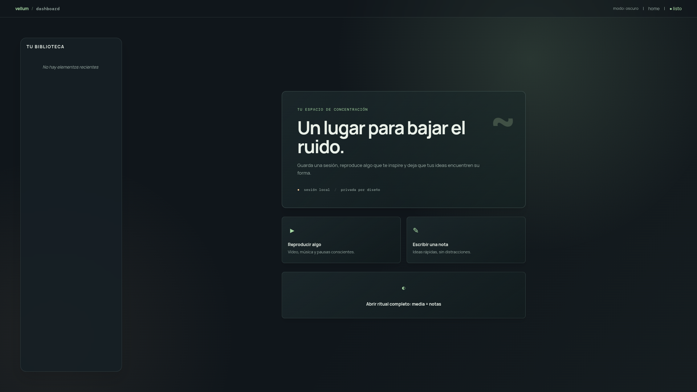

# Portfolio de proyectos

Un conjunto de experiencias digitales creadas con enfoque en producto, diseño, experiencia de usuario y desarrollo frontend.

## Overview

Este repositorio reúne una selección de proyectos orientados a resolver problemas reales con interfaces claras, visuales modernas y soluciones funcionales. La intención es mostrar una visión integral del trabajo: desde presentaciones visuales y landing pages hasta dashboards técnicos y espacios de trabajo personal.

## Qué construyo

- interfaces premium y funcionales
- experiencias web con foco en claridad y conversión
- prototipos de productos digitales con identidad visual propia
- dashboards y herramientas útiles para análisis y monitoreo
- soluciones con una fuerte sensibilidad por UX y diseño de producto

## Stack principal

- HTML5
- CSS3
- JavaScript
- Tailwind CSS
- Vite
- Electron
- Python
- FastAPI
- Chart.js
- psutil

## Proyectos destacados

### Desktop
Presentación del portfolio como un escritorio digital interactivo.

- Propósito: crear una experiencia memorable y diferenciada para mostrar trabajos, redes y contacto
- Público: recruiters, clientes y colaboradores
- Tecnologías: HTML, CSS, JavaScript

### Mercium Shop
Landing page comercial orientada a ventas y servicios digitales.

- Propósito: comunicar valor, presentar soluciones y captar leads
- Público: startups, negocios y marcas
- Tecnologías: HTML, Tailwind CSS, JavaScript

### Sysdash
Dashboard técnico para monitoreo del rendimiento del sistema.

- Propósito: visualizar CPU, RAM, disco, red y procesos activos en tiempo real
- Público: desarrolladores y usuarios técnicos
- Tecnologías: Python, FastAPI, psutil, JavaScript, Chart.js

### Vellum
Workspace visual para organizar ideas, notas y contenido personal.

- Propósito: crear un entorno de trabajo más ordenado, claro y productivo
- Público: estudiantes, creadores y profesionales
- Tecnologías: Vite, Electron, HTML, CSS, JavaScript

## Estructura del repositorio

- Desktop/ — interfaz tipo escritorio del portfolio
- mercium-shop/ — landing page comercial
- sysdash/ — dashboard de monitoreo del sistema
- vellum/ — espacio personal de trabajo visual
- assets/screenshots/ — capturas de cada proyecto

## Vista previa del portfolio

## Cómo explorar el repositorio

Cada proyecto puede abrirse directamente desde su archivo HTML o ejecutarse según su entorno específico:

- Desktop: abrir en navegador
- Mercium Shop: abrir en navegador
- Sysdash: iniciar la API backend y abrir la interfaz frontend
- Vellum: ejecutar con Vite o Electron

## Valor del portfolio

Este conjunto refleja una forma de trabajar centrada en:

- diseño moderno y estratégico
- interfaces con enfoque en UX
- productos funcionales y útiles
- exploración realista de soluciones digitales actuales

## Resumen

El portafolio presenta una mezcla de creatividad, ejecución técnica y capacidad para convertir ideas en experiencias digitales con valor real.
