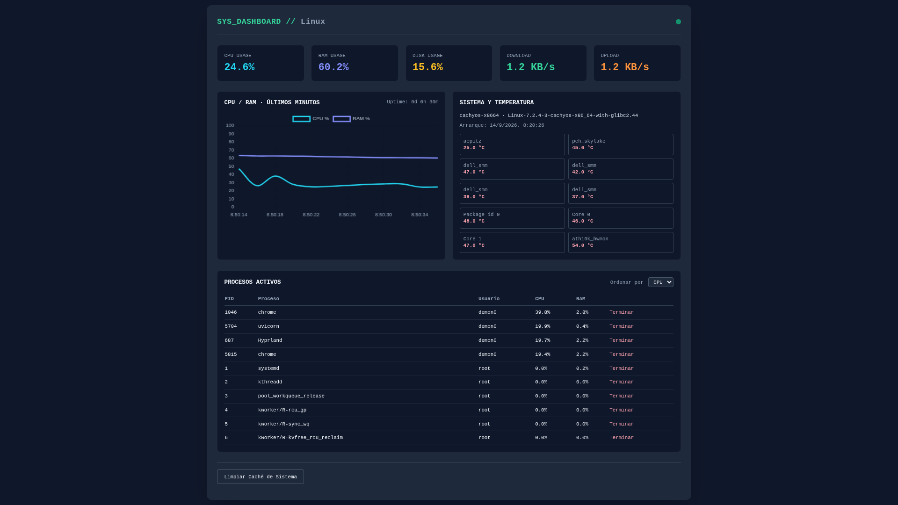

# Sysdash

Dashboard técnico para monitoreo del sistema operativo en tiempo real.

## Descripción

Sysdash es una solución que combina backend y frontend para ofrecer una vista moderna del estado del sistema. Su propósito es hacer más accesible la observación de datos técnicos como CPU, memoria, disco, red y procesos activos.

## ¿Para qué sirve?

- monitorizar el rendimiento del equipo
- detectar consumo excesivo de recursos
- observar actividad de red y procesos activos
- administrar tareas básicas del sistema desde una interfaz visual

## Público objetivo

- desarrolladores
- administradores de sistemas
- usuarios técnicos
- perfiles que necesitan análisis del rendimiento del equipo

## Stack

- Python
- FastAPI
- Uvicorn
- psutil
- JavaScript
- Tailwind CSS
- Chart.js

## Funcionalidades principales

- métricas de CPU, RAM y disco
- velocidad de subida y bajada de red
- uptime y tiempo de arranque del sistema
- temperatura del hardware si está disponible
- listado de procesos activos con orden por consumo
- terminación de procesos desde la interfaz
- limpieza de caché del sistema

## Estructura del proyecto

- `backend/`: API para obtener métricas del sistema
- `frontend/`: vista visual del dashboard

## Vista previa



## Cómo ejecutarlo

1. Entrar a `backend`.
2. Instalar dependencias:

```bash
pip install -r requirements.txt
```

3. Ejecutar la API:

```bash
uvicorn main:app --reload
```

4. Abrir `frontend/index.html` en el navegador.

## Resumen

Sysdash reúne backend y visualización moderna para convertir datos del sistema en información útil, clara y accionable.
