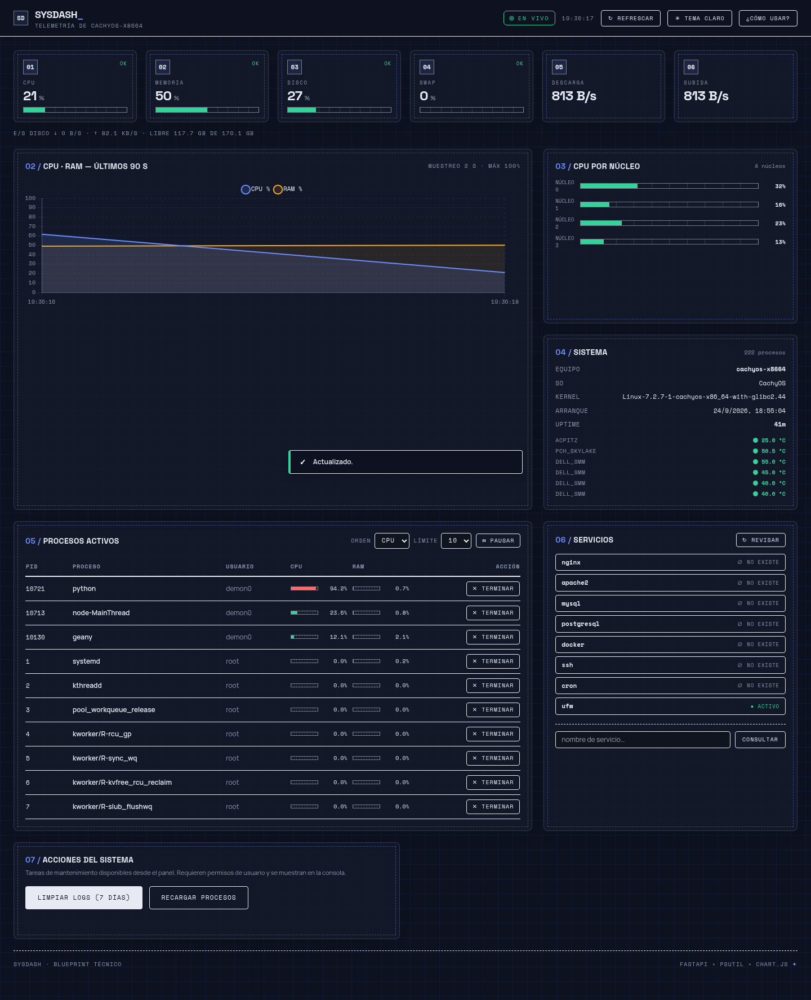
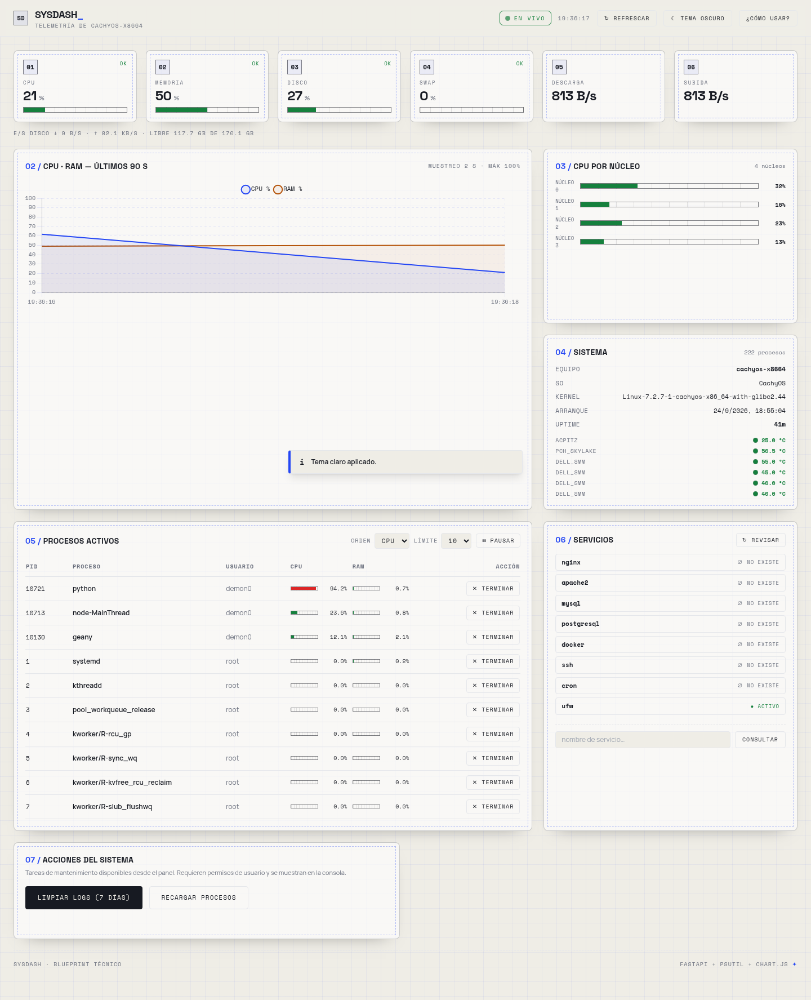
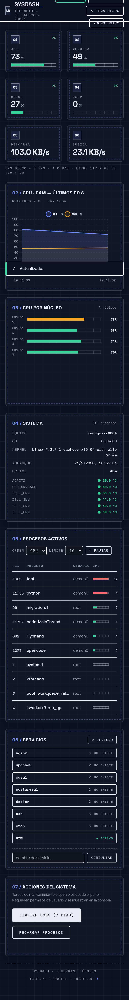

# Sysdash

Dashboard técnico para el monitoreo del sistema operativo en tiempo real, con identidad visual **«Blueprint técnico»**: papel cuadriculado, marcos discontinuos de plano, sellos de estado y fuentes de instrumentación (Space Grotesk / Manrope / Space Mono). Incluye **tema oscuro por defecto** y tema claro con conmutador.

## Capturas

**Escritorio · tema oscuro (por defecto)**



**Escritorio · tema claro**



**Móvil · tema oscuro**



## Descripción

Sysdash combina backend y frontend para ofrecer una vista completa del estado del sistema: CPU (total y por núcleo), memoria, swap, disco, red, E/S de disco, temperatura, procesos activos y estado de servicios. El dashboard lo sirve la propia API, así que solo necesitas arrancar **un proceso** y abrir **una URL**.

Un **sampler interno** muestrea el sistema cada segundo en segundo plano: la API responde instantánea (sin bloqueos por petición) y las velocidades de red y disco son correctas desde el primer render.

## Requisitos

- Python 3.10 o superior
- Linux, macOS o Windows
- Un navegador moderno (el frontend usa Tailwind CSS y Chart.js vía CDN)

## Arranque rápido (recomendado)

Desde la carpeta `backend`, usa el script de tu sistema:

**Linux / macOS**

```bash
./start.sh
```

**Windows**

```bat
start.bat
```

El script hace todo por ti:

1. Crea el entorno virtual `venv` si no existe e instala las dependencias.
2. Arranca el servidor FastAPI en `http://127.0.0.1:8000`.
3. Abre el navegador automáticamente cuando la API ya responde.

### Arranque manual (opcional)

```bash
cd backend
python3 -m venv venv
./venv/bin/pip install -r requirements.txt    # Windows: venv\Scripts\pip install -r requirements.txt
./venv/bin/python -m uvicorn main:app --reload
```

y abre `http://127.0.0.1:8000` — el frontend lo sirve el propio FastAPI, no hace falta abrir `frontend/index.html` por separado.

### Cambiar el puerto

- **Linux / macOS:** `PORT=9000 ./start.sh`
- **Windows:** edita la variable `PORT` al inicio de `start.bat`.

La API escucha solo en `127.0.0.1` por seguridad.

## Uso del dashboard

- **Tema:** el botón `☀ Tema claro / ☾ Tema oscuro` de la barra superior alterna entre los dos temas al instante. **El tema oscuro es el predeterminado** y la elección se recuerda entre sesiones (no parpadea al recargar).
- **Monitoreo:** los KPIs de CPU, memoria, disco, swap, descarga y subida se actualizan cada 2 s; el gráfico histórico muestra los últimos 90 segundos de CPU y RAM.
- **Procesos:** ordena por CPU o RAM, elige el límite (10–25) y pausa la actualización. «Terminar» abre un **modal de confirmación** antes de enviar SIGTERM.
- **Servicios:** estado de servicios del sistema (systemd en Linux, servicios en Windows) con badge `activo` / `inactivo` / `no existe`, más búsqueda manual.
- **Acciones:** limpieza de logs de systemd de más de 7 días desde la interfaz, con confirmación explicativa.
- **Conexión:** sello `● EN VIVO` / `○ SIN CONEXIÓN` con reintento automático y banner offline mientras la API no responde.

Atajos: `Esc` cierra cualquier modal de confirmación.

## Funcionalidades

- métricas de CPU (total y por núcleo), RAM, swap y disco
- velocidad de red (subida/bajada) y E/S de disco con muestreo continuo
- gráfico histórico de CPU/RAM, uptime y temperatura con umbrales
- procesos activos con orden por CPU/RAM, mini-barras y terminación con confirmación
- consulta de estado de servicios (systemd en Linux, servicios en Windows)
- limpieza de logs de systemd (7 días) desde la interfaz
- estado de conexión en tiempo real (EN VIVO / SIN CONEXIÓN) con reintento automático
- tema oscuro por defecto con conmutador a tema claro (elección guardada)
- sampler interno: la API responde instantánea y las tarifas de red/disco son correctas desde el primer render

## API

| Método | Ruta | Descripción |
| --- | --- | --- |
| GET | `/` | sirve el dashboard |
| GET | `/api/health` | estado básico de la API |
| GET | `/api/metrics` | instantánea de todas las métricas |
| GET | `/api/processes?sort_by=cpu\|memory&limit=N` | procesos ordenados (límite 1–25) |
| POST | `/api/processes/{pid}/terminate?force=false` | termina un proceso (SIGTERM; `force=true` usa SIGKILL) |
| GET | `/api/services/{name}` | estado de un servicio |
| POST | `/api/clean/cache` | vacía logs de systemd de más de 7 días |

## Notas y permisos

- Para terminar procesos o limpiar logs puede hacer falta ejecutar el servidor con permisos de administrador.
- Sysdash es un proyecto de portafolio: **solo lee métricas del sistema** y ejecuta las dos acciones explícitas de la tabla (terminar proceso, limpiar logs). No mueve ni modifica archivos del usuario.

## Estructura del proyecto

```
sysdash/
├── backend/
│   ├── main.py          # API FastAPI + sampler en segundo plano (psutil)
│   ├── requirements.txt
│   ├── start.sh         # arranque para Linux / macOS
│   └── start.bat        # arranque para Windows
├── frontend/
│   └── index.html       # dashboard (un solo archivo, tema oscuro/claro)
└── README.md
```

## Stack

- Python · FastAPI · Uvicorn · psutil
- JavaScript vanilla · Tailwind CSS · Chart.js

## Demo en vivo

https://portfolio-sysdash-enmanuel.netlify.app