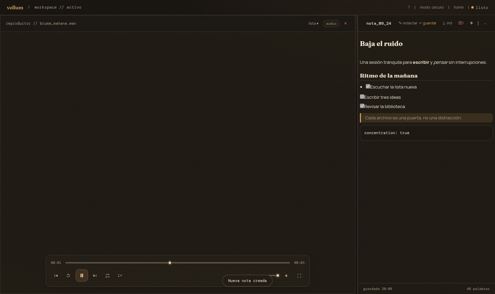
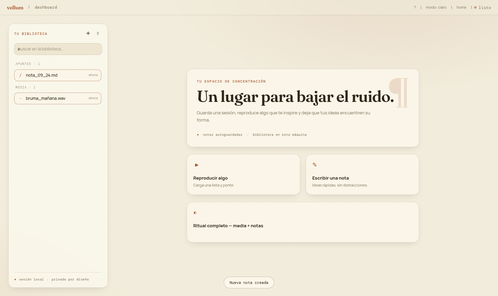
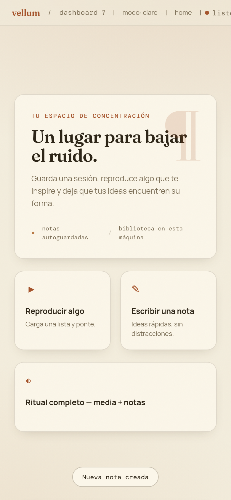

# Vellum · Papel & Tinta

Workspace de escritorio para **escuchar, mirar, anotar y pensar** — con la identidad visual editorial **«Papel & Tinta»**: papel vitela cálido, tinta, serif Fraunces y un acento ámbar que da calma y carácter.

## Capturas

**Workspace — tema nocturno (tinta)**



**Dashboard — tema claro (vitela)**



**Móvil**



## Descripción

Vellum es una aplicación de escritorio (Electron) que junta en un solo espacio dos cosas que suelen estar separadas: una **biblioteca de notas** y un **reproductor de multimedia de referencia**. La idea es simple: cargar una sesión (audio o video), abrir una nota al lado y dejar que las ideas encuentren su forma — con el ruido apagado.

La renovación a «Papel & Tinta» rediseña la interfaz, reorganiza los datos (IndexedDB v2 con notas propias), endurece la arquitectura de Electron, y suma las funciones pedidas: biblioteca de notas con vista previa Markdown y exportación, reproductor con cola y atajos de teclado, divisor redimensionable entre paneles y búsqueda en la biblioteca.

## Características

### Identidad visual «Papel & Tinta»
- dos temas: **vitela** (claro, papel `#F3EDDD` / ámbar `#A5532A`) y **tinta nocturna** (oscuro, tinta `#171410` / dorado `#D9A25F`)
- tipografía editorial: **Fraunces** (titulares serif), Manrope (texto), DM Mono (etiquetas y datos)
- textura de grano sutil, columna "¶" como marca de párrafo y sello de estado (`● listo`, `○ guardando…`)
- scrollbars, selección y focos a juego; tema aplicado antes del primer render (sin parpadeo)

### Notas (biblioteca + Markdown)
- biblioteca en la barra lateral con **búsqueda** en tiempo real sobre apuntes y media
- crear, abrir, renombrar (editable en el encabezado) y borrar notas (con confirmación)
- **autoguardado** con debounce e indicador de estado (`guardando…` / `guardado HH:MM`)
- **vista previa Markdown** en vivo (renderizador propio, sin dependencias) con toggle `editar / vista previa`
- **exportar nota como `.md`** con diálogo nativo de sistema (IPC seguro)
- contador de palabras y notas persistidas en IndexedDB

### Reproductor con cola
- arrastrar y soltar o elegir múltiples archivos (video y audio) que quedan en la **cola**
- cola persistente entre sesiones: al reabrir la app se restaura lo que estaba en reproducción (en pausa)
- controles: reproducir/pausar, anterior/siguiente, reiniciar, buscar, **repetir** (uno/todo/off), **velocidad** (0.5×–2×), volumen, silencio y pantalla completa
- avance automático al terminar cada archivo y quitar ítems de la cola con un clic

### Atajos de teclado
| tecla | acción |
| --- | --- |
| `espacio` | reproducir / pausar |
| `←` / `→` | retroceder / avanzar 5 s |
| `↑` / `↓` | subir / bajar volumen |
| `[` / `]` | anterior / siguiente |
| `n` | nueva nota |
| `r` | repetir (uno / todo / off) |
| `f` | pantalla completa |
| `m` | silenciar |
| `?` / `/` | panel de atajos |
| `esc` | cerrar paneles |
| `Ctrl+S` | guardar nota |
| `Ctrl+Shift+S` | exportar nota (.md) |

### Workspace
- **divisor redimensionable** entre reproductor y notas (arrastrar para ajustar, doble clic restablece), ratio persistido
- modo reproductor, notas o **ritual completo** (ambos paneles) · panel de notas colapsable
- preferencias (tema, volumen, ratio del split) persistidas en `localStorage`; notas y media en IndexedDB
- sin overflow horizontal en escritorio ni móvil (verificado), interfaz 100% en español

## Arquitectura

- **Electron endurecido**: `contextIsolation: true`, `nodeIntegration: false`, puente IPC mínimo vía `preload.js`, instancia única, posición/tamaño de ventana persistidos, menú nativo reducido en español
- **Datos v2 (IndexedDB)**: stores `notes` (título, contenido, fechas) y `media` (blobs por id); migración automática desde la v1 (recents + `mediaFiles`) sin perder lo que ya había
- **Frontend separado**: `src/app.js` (lógica) + `src/markdown.js` (renderizador Markdown propio y seguro) + `src/index.html` + `src/index.css`
- build Vite con **script único clásico (IIFE)**: funciona igual por `file://` (Electron) que por HTTP, evitando el bloqueo CORS de los ES modules sobre `file://`
- ícono de marca generado desde `build/icon.svg` (PNG multi-tamaño + `.ico`)

## Cómo ejecutarlo

```bash
cd vellum
npm install

# modo desarrollo con recarga en caliente (http://localhost:5174)
npm run dev

# escritorio (Electron)
npm run desktop
```

O con los arranques simplificados (instalan, compilan y abren):

```bash
./start.sh        # Linux / macOS
start.bat         # Windows
```

## Empaquetado

Se generan ejecutables en `release/`:

| plataforma | artefacto | cómo |
| --- | --- | --- |
| **Linux** | `vellum-1.1.0-linux-x86_64.AppImage` | `npm run dist:linux` |
| **Windows (portátil)** | `vellum-1.1.0-win-x64.zip` (contiene `Vellum.exe`) | `npm run dist:win` |
| Windows (instalador NSIS) | `.exe` | en Windows: `npm run dist:win-installer` |
| **macOS** | `.dmg` + `.zip` | en una Mac: `npm run dist:mac` |

> El AppImage de Linux y el zip portátil de Windows se construyen desde este repo (sin necesidad de la plataforma destino). El `.dmg` y el instalador NSIS requieren su plataforma nativa (macOS / Windows con wine).

## Stack

- Electron 30 · Vite 5 · Tailwind CSS 4
- JavaScript (vanilla) · IndexedDB · HTML5/CSS3
- Fuentes: Fraunces, Manrope, DM Mono

## Estructura

```
vellum/
├── main.js            # Electron: ventana segura, menú, IPC de exportación
├── preload.js         # puente contextBridge mínimo (window.vellum)
├── src/
│   ├── index.html     # markup de la app (dashboard + workspace)
│   ├── index.css      # identidad «Papel & Tinta» (temas vitela / tinta)
│   ├── app.js         # lógica: notas, cola, atajos, splitter, búsqueda
│   └── markdown.js    # renderizador Markdown propio y seguro
├── build/icon.svg     # marca › PNG + .ico generados
├── vite.config.js     # build IIFE de un solo script
├── start.sh / start.bat
└── README.md
```

## Nota de versión

Vellum 1.1 estrena la identidad «Papel & Tinta», biblioteca de notas con Markdown y exportación, reproductor con cola y atajos, divisor de paneles y búsqueda; mantiene las sesiones anteriores vía migración automática de datos.